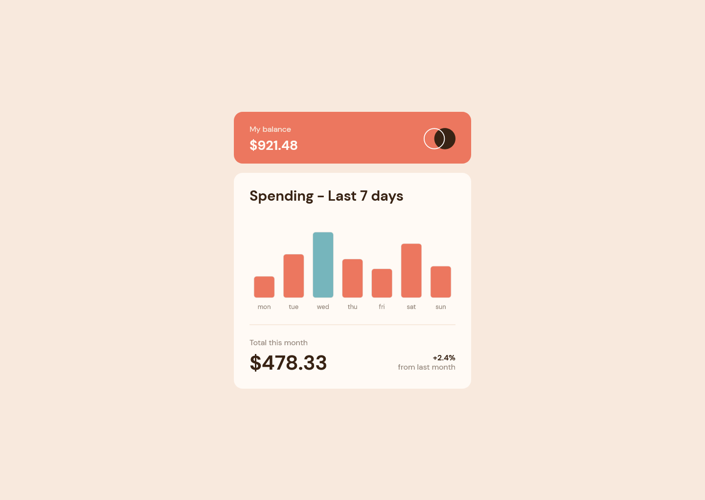

# Frontend Mentor - Expenses chart component solution

This is a solution to the [Expenses chart component challenge on Frontend Mentor](https://www.frontendmentor.io/challenges/expenses-chart-component-e7yJBUdjwt). Frontend Mentor challenges help you improve your coding skills by building realistic projects. 

## Table of contents

- [Overview](#overview)
  - [The challenge](#the-challenge)
  - [Screenshot](#screenshot)
  - [Links](#links)
- [My process](#my-process)
  - [Built with](#built-with)
  - [Useful resources](#useful-resources)
- [Author](#author)

## Overview

### The challenge

Users should be able to:

- View the bar chart and hover over the individual bars to see the correct amounts for each day
- See the current day’s bar highlighted in a different colour to the other bars
- View the optimal layout for the content depending on their device’s screen size
- See hover states for all interactive elements on the page
- **Bonus**: Use the JSON data file provided to dynamically size the bars on the chart

### Screenshot

### Links

- Solution URL: [Solution](https://www.frontendmentor.io/solutions/expenses-chart-component-oKycETyIkK)
- Live Site URL: [Live Demo](https://james-alderson.github.io/Fork-Expenses-chart-component/)

## My process

### Built with

- Semantic HTML5 markup
- CSS custom properties
- Flexbox
- CSS Grid
- [Chart.js](https://www.chartjs.org/) - JS library

### Useful resources

- [Chartjs](https://www.chartjs.org/docs/latest/) - This helped me for how to create chart by chartjs library
- [Traversy Media](https://www.youtube.com/watch?v=PoRJizFvM7s) - This helped me for understand how to get and show on asynchronous data
- [Traversy Media](https://www.youtube.com/watch?v=Oive66jrwBs) - This helped me for how to get data from external file or web api by use fetch API

## Author

- Frontend Mentor - [@James-alderson](https://www.frontendmentor.io/profile/James-alderson)
